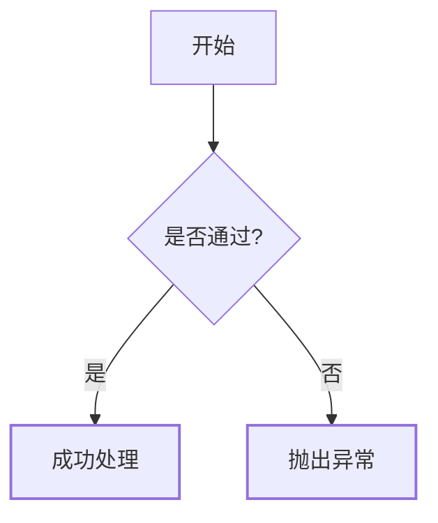
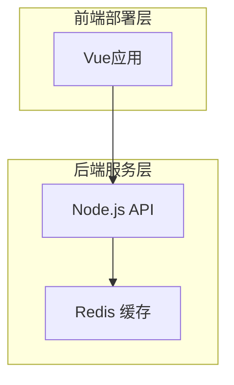

蓝图主管官网【Q-——333307——】蓝图主管官网【 辋芷《888yx●vip》 】
蓝图主管官网【Q-——333307——】蓝图主管官网【 辋芷《888yx●vip》 】

 用上这3个技巧，你的Mermaid流程图在GitHub上会更好看

> 还在为README里的流程图又乱又丑发愁？今天分享几个简单技巧，让你的Mermaid图表不仅更清晰，还能直接提升项目文档的专业度。

GitHub对Mermaid的支持越来越成熟，但很多人画完图就完事了，压根没发挥出它的全部潜力。调整几个小地方，观感完全不同。

 一、图表方向别乱选，逻辑清晰是第一位

默认是自上而下的`TD`，但复杂的架构或时序关系更适合`LR`（从左到右）。分支多的时候，左右排列可读性更高。

互动引导：你平时用的是TD还是LR？评论区聊聊哪个更顺手。

 二、节点配色和边框，决定了文档的质感

纯白背景+黑线真的很容易淹没在代码里。给重要节点加上高亮底色，或给条件判断加上双重边框，视觉层次一下子就有了。

 三、子图表分组，让复杂关系变清晰

用`subgraph`把不同模块圈起来，看图的人第一眼就能看懂系统分层，而不是对着节点思考半天逻辑。

 四、进阶技巧：让GitHub直接渲染更优雅

在README中，如果想让生成的图表更宽松、不贴边，记得加上描述语句。另外，在代码块中声明为`mermaid`，GitHub会自动渲染，无需额外插件。

 干货加餐：常用配置参数

- `%%{init: {"theme": "base", "themeVariables": {"primaryColor": "f0f8ff"}}}%%` 可以自定义主题色。
- `flowchart` 语法中，节点文字有特殊字符时，记得用引号包裹。

---

觉得今天的内容有用？欢迎点赞转发，让更多人用上这些让文档变精致的小技巧。

如果你有好的Mermaid使用心得或配色方案，也欢迎在评论区晒图，我会挑有趣的互动置顶，一起把GitHub主页做得更漂亮。

相关推荐：

https://github.com/martinezkelly827/fwhecg/blob/main/%E6%B2%89%E9%86%89%E6%96%87%E5%BF%83%E5%AF%BB%E6%A2%A6%EF%BC%9A%E4%B9%90%E5%AF%8C%E5%B9%B3%E5%8F%B0%E6%B3%A8%E5%86%8C_%E5%BB%B6%E6%BB%A4%E5%A0%AA%E7%AB%AF%E8%91%B1PWQEG.md

相关推荐：

https://github.com/martinezkelly827/fwhecg/commit/b3bedfa644948d6706c6d3d10ee99af075c9b860

相关推荐：

https://github.com/rhodesandrea462/zjvmux/blob/main/2026%E7%A7%91%E6%8A%80%E7%94%84%E9%80%89%EF%BC%9A%E4%B9%90%E5%AF%8C%E5%B9%B3%E5%8F%B0%E5%BC%80%E6%88%B7_%E7%85%8C%E6%B6%8E%E4%BB%A5%E8%8B%9B%E5%92%90GNHOP.md

相关推荐：

https://github.com/rhodesandrea462/zjvmux/commit/9a866f831a6e497089146e4a5e6d96ff26d9a580

资讯来源：新华网、人民网、央视新闻、中新网、凤凰网、澎湃新闻、界面新闻、新浪新闻、搜狐网、财新网、观察者网、第一财经等主流平台，以独树一帜的观察视角与扎实的深度报道能力，在资讯领域收获广泛关注。
